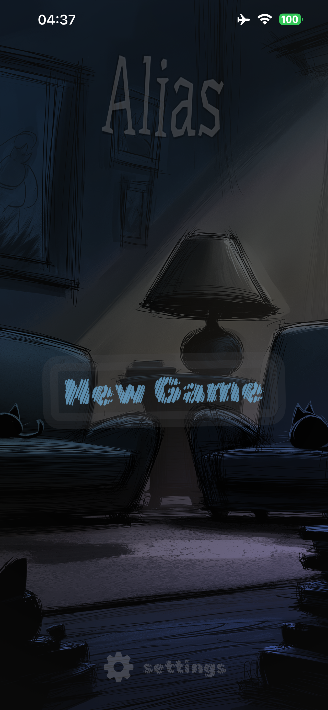
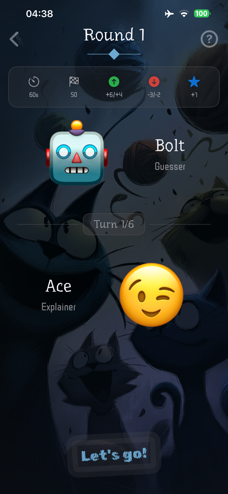

# Alias

Alias is a SwiftUI party word game for iPhone and iPad. Players take turns explaining words to each other, scoring points for guessed words and losing points for skips. The app includes built-in dictionaries and can generate custom dictionaries through OpenRouter.

## Screenshots

| Home | New Game | Gameplay | Results |
| --- | --- | --- | --- |
|  |  |  |  |

## Features

- Localized UI in English, Ukrainian, and Russian.
- Built-in Easy, Medium, and Hard dictionaries.
- AI-generated custom dictionaries through OpenRouter with player-configurable API key and model name.
- Streaming generation progress with visible word-count updates.
- Configurable round time, points to win, scoring, penalties, and last-word bonus.
- SwiftUI navigation flow: Home -> New Game -> Turn Start -> Gameplay -> Results -> Winner.
- Sound and haptic feedback toggles.

## Requirements

- Xcode 26 or newer.
- iOS 26 SDK or compatible simulator/device.
- Optional: an OpenRouter API key for AI dictionary generation.

## OpenRouter Setup

The app does not store an API key in source code. Each player can enter their own OpenRouter API key and model in the in-app settings sheet from the home screen. The API key is saved in Keychain on that device, and the model name defaults to:

```text
google/gemini-3.1-flash-lite
```

For local development, the API service also supports these fallbacks when no key is saved in settings:

1. Set the `OPENROUTER_API_KEY` environment variable in the Xcode scheme.
2. Add an `OpenRouterAPIKey` value to the app Info.plist locally. Do not commit private keys.

Custom dictionary generation uses OpenRouter chat completions with streaming enabled.

If no key is available, the generation modal shows an error instead of freezing or creating mock data.

## Release Hygiene

The repository ignores Xcode user data, build products, local environment files, and common secret files. Do not commit private API keys, local `.xcuserstate` files, `.DS_Store`, or provisioning/signing artifacts.

## Project Structure

- `Alias/AliasApp.swift`: app entry point and root navigation.
- `Alias/Core`: API, localization, constants, theme, and navigation helpers.
- `Alias/Managers`: game state, dictionary generation, players, settings, words, animation, and feedback.
- `Alias/Models`: game data models.
- `Alias/ViewModels`: screen view models.
- `Alias/Views`: SwiftUI screens and reusable components.
- `Alias/Resources`: assets, fonts, and localization files.
- `AliasTests`: unit tests.
- `docs/screenshots`: README screenshots.
- `.github/workflows/tests.yml`: GitHub Actions test workflow.

## Build

```sh
xcodebuild build -project "Alias.xcodeproj" -scheme "Alias" -destination 'platform=iOS Simulator,name=iPhone 17,OS=26.5'
```

## Test

```sh
xcodebuild test -project "Alias.xcodeproj" -scheme "Alias" -destination 'platform=iOS Simulator,name=iPhone 17,OS=26.5' -only-testing:AliasTests
```

If the simulator service is unhealthy, reboot the selected simulator and rerun the command.

## Localization

Localization lives in:

- `Alias/Resources/Localization/en.lproj/Localizable.strings`
- `Alias/Resources/Localization/uk.lproj/Localizable.strings`
- `Alias/Resources/Localization/ru.lproj/Localizable.strings`

When adding user-visible text, add a key to all three files and expose it through `L` in `Core/Localization.swift`.
